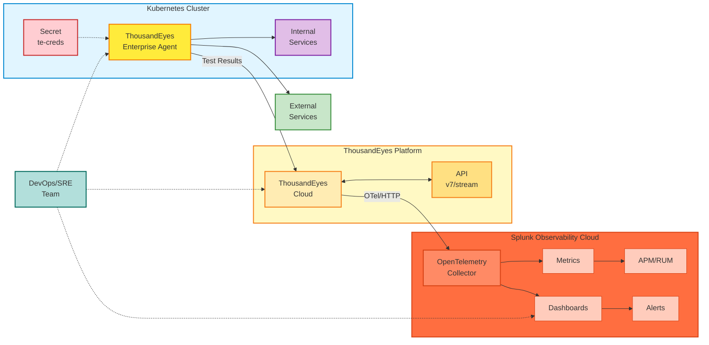
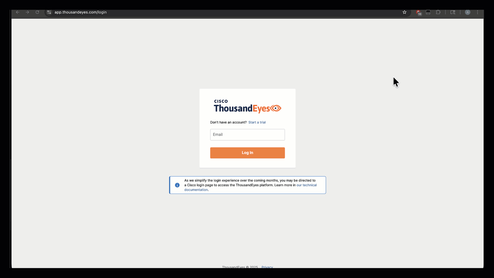

# ThousandEyes and Splunk Observability Lab
Thousand Eyes Enterprise Agent Deployment in Kubernetes

## Overview

This repository provides Kubernetes deployment manifests for running a Cisco ThousandEyes Enterprise Agent within your cluster. This enables synthetic monitoring and testing capabilities from inside your Kubernetes environment.

This lab demonstrates integrating **ThousandEyes with Splunk Observability Cloud** to provide unified visibility across your synthetic monitoring and observability data.

> **Note:** This is **not an officially supported** ThousandEyes agent deployment configuration. However, it has been tested and works very well in production-like environments.

## ThousandEyes Agent Types

### Enterprise Agents
Enterprise Agents are software-based monitoring agents that you deploy within your own infrastructure. They provide:
- **Inside-out visibility**: Monitor and test from your internal network to external services
- **Customizable placement**: Deploy where your users and applications are
- **Full test capabilities**: HTTP, network, DNS, voice, and other test types
- **Persistent monitoring**: Continuously running agents that execute scheduled tests

In this lab, we're deploying an Enterprise Agent as a containerized workload inside a Kubernetes cluster.

### Endpoint Agents
Endpoint Agents are lightweight agents installed on end-user devices (laptops, desktops) that provide:
- **Real user perspective**: Monitor from actual user endpoints
- **Browser-based monitoring**: Capture real user experience metrics
- **Session data**: Detailed insights into application performance from the user's viewpoint

This repository focuses on **Enterprise Agent** deployment only.

## Architecture



### Architecture Components

#### 1. Kubernetes Cluster
- **Secret (te-creds)**: Stores the base64-encoded `TEAGENT_ACCOUNT_TOKEN` for authentication
- **ThousandEyes Enterprise Agent Pod**:
  - Container image: `thousandeyes/enterprise-agent:latest`
  - Hostname: `te-agent-aleccham` (customizable)
  - Security capabilities: `NET_ADMIN`, `SYS_ADMIN` (required for network testing)
  - Memory allocation: 2GB request, 3.5GB limit
  - Network mode: IPv4 only
- **Internal Services**: Kubernetes workloads including REST APIs, microservices, databases, and gRPC services

#### 2. Test Targets
- **Internal Services**: Monitor services within the Kubernetes cluster
- **External Services**: Test external dependencies such as:
  - Payment gateways (Stripe, PayPal)
  - Third-party APIs
  - SaaS applications
  - CDN endpoints
  - Public websites

#### 3. ThousandEyes Platform
- **ThousandEyes Cloud**: Central platform for:
  - Agent registration and management
  - Test configuration and scheduling
  - Metrics collection and aggregation
  - Built-in alerting engine
- **ThousandEyes API**: RESTful API (v7/stream endpoint) for programmatic access

#### 4. Test Types & Metrics
The Enterprise Agent performs:
- **HTTP/HTTPS tests**: Web page availability, response times, status codes
- **DNS tests**: Resolution time, record validation
- **Network layer tests**: Latency, packet loss, path visualization
- **Voice/RTP tests**: Quality metrics for voice traffic

Metrics collected include:
- HTTP server availability (%)
- Throughput (bytes/s)
- Request duration (seconds)
- Page load completion (%)
- Error codes and failure reasons

#### 5. Splunk Observability Cloud Integration
- **OpenTelemetry Collector**: 
  - Endpoint: `https://ingest.{realm}.signalfx.com/v2/datapoint/otlp`
  - Protocol: HTTP or gRPC
  - Format: Protobuf
  - Authentication: `X-SF-Token` header
  - Signal type: Metrics (OpenTelemetry v2)
- **Observability Features**:
  - **Metrics**: Real-time visualization of ThousandEyes data
  - **Dashboards**: Pre-built ThousandEyes dashboard with unified views
  - **APM/RUM Integration**: Correlate synthetic tests with application traces and real user monitoring
  - **Alerting**: Centralized alert management with correlation rules

#### 6. Data Flow
1. Agent authenticates using token from Kubernetes Secret
2. Agent runs scheduled tests against internal and external targets
3. Test results sent to ThousandEyes Cloud
4. ThousandEyes streams metrics to Splunk via OpenTelemetry protocol
5. Splunk ingests, processes, and visualizes data in dashboards
6. DevOps/SRE teams monitor dashboards and respond to alerts

### Testing Capabilities

With this deployment, you can:
- ✅ **Test internal services**: Monitor Kubernetes services, APIs, and microservices from within the cluster
- ✅ **Test external dependencies**: Validate connectivity to payment gateways, third-party APIs, and SaaS platforms
- ✅ **Measure performance**: Capture latency, availability, and performance metrics from your cluster's perspective
- ✅ **Troubleshoot issues**: Identify whether problems originate from your infrastructure or external dependencies

### Splunk Observability Cloud Integration

By connecting ThousandEyes to Splunk Observability Cloud, you gain:
- 🔗 **Unified visibility**: Correlate synthetic test results with real user monitoring (RUM), APM traces, and infrastructure metrics
- 📊 **Enhanced dashboards**: Visualize ThousandEyes data alongside your existing Splunk observability metrics
- 🚨 **Centralized alerting**: Configure alerts based on ThousandEyes test results within Splunk
- 🔍 **Root cause analysis**: Quickly identify if issues are network-related (ThousandEyes) or application-related (APM)
- 📈 **Comprehensive analytics**: Analyze synthetic monitoring trends with Splunk's powerful analytics engine

## Prerequisites

This deployment assumes:
- You have a Kubernetes cluster (v1.16+)
- You have RBAC permissions to deploy resources in your chosen namespace
- You have a ThousandEyes account with access to Enterprise Agent tokens

## Components

This deployment consists of two files:

### 1. Secrets File (`credentialsSecret.yaml`)

Contains your ThousandEyes agent token (base64 encoded). This secret is referenced by the deployment to authenticate the agent with ThousandEyes Cloud.

```yaml
apiVersion: v1
kind: Secret
metadata:
  name: te-creds
type: Opaque
data:
  TEAGENT_ACCOUNT_TOKEN: <base64-encoded-token>
```

**How to create your secret:**

1. Log in to the ThousandEyes platform at [app.thousandeyes.com/login](https://app.thousandeyes.com/login)

2. Navigate to **Cloud & Enterprise Agents > Agent Settings > Add New Enterprise Agent**

   

3. Copy your **Account Group Token**

4. Base64 encode the token:

   ```bash
   echo -n 'your-token-here' | base64
   ```

5. Update the `TEAGENT_ACCOUNT_TOKEN` value in `credentialsSecret.yaml` with the base64-encoded output

### 2. Deployment Manifest (`thousandEyesDeploy.yaml`)

Defines the Enterprise Agent pod configuration with the following key settings:

- **Namespace**: `te-demo` (customize as needed)
- **Image**: `thousandeyes/enterprise-agent:latest` from Docker Hub
- **Hostname**: `te-agent-aleccham` (appears in ThousandEyes dashboard)
- **Capabilities**: Requires `NET_ADMIN` and `SYS_ADMIN` for network testing
- **Resources**: 
  - Memory limit: 3584Mi
  - Memory request: 2000Mi
- **Environment Variables**:
  - `TEAGENT_ACCOUNT_TOKEN`: Pulled from the secret
  - `TEAGENT_INET`: Set to `"4"` for IPv4 only

```yaml
apiVersion: apps/v1
kind: Deployment
metadata:
  namespace: te-demo
  name: thousandeyes
spec:
  replicas: 1
  template:
    spec:
      hostname: te-agent-aleccham
      containers:
      - name: thousandeyes
        image: 'thousandeyes/enterprise-agent:latest'
        securityContext:
          capabilities:
            add:
              - NET_ADMIN
              - SYS_ADMIN
        env:
          - name: TEAGENT_ACCOUNT_TOKEN
            valueFrom:
              secretKeyRef:
                name: te-creds
                key: TEAGENT_ACCOUNT_TOKEN
```

**Important notes:**
- The agent requires elevated privileges (`NET_ADMIN`, `SYS_ADMIN`) to perform network tests
- Adjust the `hostname` field to uniquely identify your agent in the ThousandEyes dashboard
- Modify the `namespace` to match your Kubernetes environment

## Installation

1. Create the namespace (if it doesn't exist):

   ```bash
   kubectl create namespace te-demo
   ```

2. Update the secrets file with your base64-encoded ThousandEyes agent token (see Components section above)

3. Apply both manifests:

   ```bash
   kubectl apply -f credentialsSecret.yaml
   kubectl apply -f thousandEyesDeploy.yaml
   ```

4. Verify the agent is running:

   ```bash
   kubectl get pods -n te-demo
   ```

   Expected output:
   ```
   NAME                            READY   STATUS    RESTARTS   AGE
   thousandeyes-xxxxxxxxxx-xxxxx   1/1     Running   0          2m
   ```

5. Check the logs to ensure the agent is connecting:

   ```bash
   kubectl logs -n te-demo -l app=thoudsandeyes
   ```

6. Verify in the ThousandEyes dashboard that the agent has registered successfully:

   

   Navigate to **Cloud & Enterprise Agents > Agent Settings** to see your newly registered agent

## Integrating with Splunk Observability Cloud

### About Splunk Observability Cloud

Splunk Observability Cloud is a real-time observability platform purpose-built for monitoring metrics, traces, and logs at scale. It ingests OpenTelemetry data and provides advanced dashboards and analytics to help teams detect and resolve performance issues quickly. This guide explains how to integrate ThousandEyes data with Splunk Observability Cloud using OpenTelemetry.

For more information about sending metrics to Splunk Observability Cloud using OpenTelemetry, see [Splunk Observability Cloud: Manage Data](https://docs.splunk.com/observability).

### Step 1: Create a Splunk Observability Cloud Access Token

To send data to Splunk Observability Cloud, you need an access token. Follow these steps:

1. In the Splunk Observability Cloud platform, go to **Settings > Access Token**
2. Click **Create Token**
3. Enter a **Name**
4. Select **Ingest** scope
5. Select **Create** to generate your access token
6. Copy the access token and store it securely

You need the access token to send telemetry data to Splunk Observability Cloud.

For more information, see [Create and manage organization access tokens using Splunk Observability Cloud](https://docs.splunk.com/observability/en/admin/authentication/authentication-tokens/org-tokens.html).

### Step 2: Create an Integration

#### Create an Integration Using the ThousandEyes UI

To integrate Splunk Observability Cloud with ThousandEyes:

1. Log in to your account on the ThousandEyes platform and go to **Manage > Integration > Integration 1.0**
2. Click **New Integration** and select **OpenTelemetry Integration**

   

3. Enter a **Name** for the integration
4. Set the **Target** to **HTTP**
5. Enter the **Endpoint URL**: `https://ingest.{REALM}.signalfx.com/v2/datapoint/otlp`
   - Replace `{REALM}` with your Splunk environment (e.g., `us1`, `eu0`)
6. For **Preset Configuration**, select **Splunk Observability Cloud**
7. For **Auth Type**, select **Custom**
8. Add the following **Custom Headers**:
   - `X-SF-Token: {TOKEN}` (Enter your Splunk Observability Cloud access token created in Step 1)
   - `Content-Type: application/x-protobuf`
9. For **OpenTelemetry Signal**, select **Metric**
10. For **Data Model Version**, select **v2**
11. Select a test (For more information on creating a test, see [General Setup Instructions](https://docs.thousandeyes.com/))
12. Click **Save** to complete the integration setup

   

You have now successfully integrated your ThousandEyes data with Splunk Observability Cloud.

#### Manage Integrations in the UI

For more information on managing OpenTelemetry integrations, including listing, editing, and deleting integrations, see [Manage Integrations Using the UI - Integrations 1.0](https://docs.thousandeyes.com/).

#### Create an Integration Using the ThousandEyes API

For a programmatic integration, use the following API commands:

**Using HTTP Protocol:**

```bash
curl -v -XPOST https://api.thousandeyes.com/v7/stream \
  -H "Content-Type: application/json" \
  -H "Authorization: Bearer $BEARER_TOKEN" \
  -d '{
    "type": "opentelemetry",
    "testMatch": [{
      "id": "281474976717575",
      "domain": "cea"
    }],
    "endpointType": "http",
    "streamEndpointUrl": "https://ingest.{REALM}.signalfx.com:443/v2/datapoint/otlp",
    "customHeaders": {
      "X-SF-Token": "{TOKEN}",
      "Content-Type": "application/x-protobuf"
    }
  }'
```

**Using gRPC Protocol:**

```bash
curl -v -XPOST https://api.thousandeyes.com/v7/stream \
  -H "Content-Type: application/json" \
  -H "Authorization: Bearer $BEARER_TOKEN" \
  -d '{
    "type": "opentelemetry",
    "testMatch": [{
      "id": "281474976717575",
      "domain": "cea"
    }],
    "endpointType": "grpc",
    "streamEndpointUrl": "https://ingest.{REALM}.signalfx.com:443",
    "customHeaders": {
      "X-SF-Token": "{TOKEN}",
      "Content-Type": "application/x-protobuf"
    }
  }'
```

Replace `streamEndpointUrl` and `X-SF-Token` values with the correct values for your Splunk Observability Cloud instance.

### ThousandEyes Dashboard in Splunk Observability Cloud

Once the integration is set up, you can view real-time monitoring data in the ThousandEyes Network Monitoring Dashboard within Splunk Observability Cloud. The dashboard includes:

- **HTTP Server Availability (%)**: Displays the availability of monitored HTTP servers
- **HTTP Throughput (bytes/s)**: Shows the data transfer rate over time
- **Client Request Duration (seconds)**: Measures the latency of client requests
- **Web Page Load Completion (%)**: Indicates the percentage of successful page loads
- **Page Load Duration (seconds)**: Displays the time taken to load pages

You can download the dashboard template from the following link: [Download ThousandEyes Splunk Observability Cloud dashboard template (Google Drive)](https://drive.google.com/file/d/1xpdjr5CRBC-JBM9tGsNFcVYp3C-tJC8s/view?usp=sharing).

## Replicating AppDynamics Test Recommendations with Kubernetes Service Discovery

### Overview

AppDynamics offers a feature called "Test Recommendations" that automatically suggests synthetic tests for your application endpoints. With ThousandEyes deployed inside your Kubernetes cluster, you can replicate this capability by leveraging Kubernetes service discovery combined with Splunk Observability Cloud's unified view.

Since the ThousandEyes Enterprise Agent runs **inside the cluster**, it can directly test internal Kubernetes services using their service names as hostnames. This provides a powerful way to monitor backend services that may not be exposed externally.

### How It Works

1. **Service Discovery**: Use `kubectl get svc` to enumerate services in your cluster
2. **Hostname Construction**: Build test URLs using Kubernetes DNS naming convention: `<service-name>.<namespace>.svc.cluster.local`
3. **Test Creation**: Configure ThousandEyes HTTP Server tests targeting these internal services
4. **Correlation in Splunk**: View synthetic test results alongside APM traces and infrastructure metrics

### Benefits of In-Cluster Testing

- ✅ **Internal Service Monitoring**: Test backend services not exposed to the internet
- ✅ **Service Mesh Awareness**: Monitor services behind Istio, Linkerd, or other service meshes
- ✅ **DNS Resolution Testing**: Validate Kubernetes DNS and service discovery
- ✅ **Network Policy Validation**: Ensure network policies allow proper communication
- ✅ **Latency Baseline**: Measure cluster-internal network performance
- ✅ **Pre-Production Testing**: Test services before exposing them via Ingress/LoadBalancer

### Step-by-Step Guide

#### 1. Discover Kubernetes Services

List all services in your cluster or a specific namespace:

```bash
# Get all services in all namespaces
kubectl get svc --all-namespaces

# Get services in a specific namespace
kubectl get svc -n production

# Get services with detailed output including ports
kubectl get svc -n production -o wide
```

Example output:
```
NAMESPACE    NAME           TYPE        CLUSTER-IP      PORT(S)    AGE
production   api-gateway    ClusterIP   10.96.100.50    8080/TCP   5d
production   payment-svc    ClusterIP   10.96.100.51    8080/TCP   5d
production   auth-service   ClusterIP   10.96.100.52    9000/TCP   5d
production   postgres       ClusterIP   10.96.100.53    5432/TCP   5d
```

#### 2. Build Test Hostnames

Kubernetes services are accessible via DNS using the following naming pattern:

```
<service-name>.<namespace>.svc.cluster.local
```

For the services above:
- `api-gateway.production.svc.cluster.local:8080`
- `payment-svc.production.svc.cluster.local:8080`
- `auth-service.production.svc.cluster.local:9000`

**Shorthand within the same namespace:**
If testing services in the same namespace as the ThousandEyes agent, you can use just the service name:
- `api-gateway:8080`
- `payment-svc:8080`

#### 3. Create ThousandEyes Tests for Internal Services

For each service endpoint, create an HTTP Server test in ThousandEyes:

**Via ThousandEyes UI:**

1. Navigate to **Cloud & Enterprise Agents > Test Settings**
2. Click **Add New Test** → **HTTP Server**
3. Configure the test:
   - **Test Name**: `[K8s] API Gateway Health`
   - **URL**: `http://api-gateway.production.svc.cluster.local:8080/health`
   - **Interval**: 2 minutes (or desired frequency)
   - **Agents**: Select your Kubernetes-deployed Enterprise Agent
   - **HTTP Response Code**: `200` (expected)
4. Click **Create Test**

**Via ThousandEyes API:**

```bash
curl -X POST https://api.thousandeyes.com/v6/tests/http-server/new \
  -H "Content-Type: application/json" \
  -H "Authorization: Bearer $BEARER_TOKEN" \
  -d '{
    "testName": "[K8s] API Gateway Health",
    "url": "http://api-gateway.production.svc.cluster.local:8080/health",
    "interval": 120,
    "agents": [
      {"agentId": "<your-k8s-agent-id>"}
    ],
    "httpTimeLimit": 5000,
    "targetResponseTime": 1000,
    "alertsEnabled": 1
  }'
```

#### 5. Configure Alerting Rules

Set up alerts for common failure scenarios:

- **Availability Alert**: Trigger when HTTP response is not 200
- **Performance Alert**: Trigger when response time exceeds baseline
- **DNS Resolution Alert**: Trigger when service DNS cannot be resolved

#### 6. View Results in Splunk Observability Cloud

Once tests are running and integrated with Splunk:

1. **Navigate to the ThousandEyes Dashboard** in Splunk Observability Cloud
2. **Filter by test name** (e.g., `[K8s]` prefix) to see all Kubernetes internal tests
3. **Correlate with APM data**:
   - View synthetic test failures alongside APM error rates
   - Identify if issues are network-related (ThousandEyes) or application-related (APM)
4. **Create custom dashboards** combining:
   - ThousandEyes HTTP availability metrics
   - APM service latency and error rates
   - Kubernetes infrastructure metrics (CPU, memory, pod restarts)

### Example Use Cases

#### Use Case 1: Microservices Health Checks

```bash
# Test multiple microservice health endpoints
http://user-service.production.svc.cluster.local:8080/actuator/health
http://order-service.production.svc.cluster.local:8080/actuator/health
http://inventory-service.production.svc.cluster.local:8080/actuator/health
```

#### Use Case 2: API Gateway Endpoint Testing

```bash
# Test API gateway routes
http://api-gateway.production.svc.cluster.local:8080/api/v1/users
http://api-gateway.production.svc.cluster.local:8080/api/v1/orders
http://api-gateway.production.svc.cluster.local:8080/api/v1/products
```

#### Use Case 3: Database Connection Testing

While ThousandEyes is primarily for HTTP testing, you can test database proxies:

```bash
# Test PgBouncer or database HTTP management interfaces
http://pgbouncer.production.svc.cluster.local:8080/stats
http://redis-exporter.production.svc.cluster.local:9121/metrics
```

### Best Practices

1. **Use Consistent Naming**: Prefix test names with `[K8s]` or `[Internal]` for easy filtering
2. **Test Health Endpoints First**: Start with `/health` or `/readiness` endpoints before testing business logic
3. **Set Appropriate Intervals**: Use shorter intervals (1-2 minutes) for critical services
4. **Tag Tests**: Use ThousandEyes labels/tags to group tests by:
   - Environment (dev, staging, production)
   - Service type (API, database, cache)
   - Team ownership
5. **Monitor Test Agent Health**: Ensure the ThousandEyes agent pod is healthy and has sufficient resources
6. **Correlate with APM**: Create Splunk dashboards that show both synthetic and real user metrics side-by-side

### Troubleshooting

#### Test Failing with DNS Resolution Error

```bash
# Verify DNS from within the ThousandEyes pod
kubectl exec -n te-demo -it <pod-name> -- nslookup api-gateway.production.svc.cluster.local

# Check CoreDNS logs
kubectl logs -n kube-system -l k8s-app=kube-dns
```

#### Connection Refused Errors

```bash
# Verify service endpoints exist
kubectl get endpoints -n production api-gateway

# Check if pods are ready
kubectl get pods -n production -l app=api-gateway

# Test connectivity from agent pod
kubectl exec -n te-demo -it <pod-name> -- curl -v http://api-gateway.production.svc.cluster.local:8080/health
```

#### Network Policy Blocking Traffic

```bash
# List network policies
kubectl get networkpolicies -n production

# Describe network policy
kubectl describe networkpolicy <policy-name> -n production

# If needed, add policy to allow traffic from te-demo namespace
```

## Background

ThousandEyes does not provide official Kubernetes deployment documentation. Their standard deployment method uses `docker run` commands, which makes it challenging to translate into reusable Kubernetes manifests. This repository bridges that gap by providing production-ready Kubernetes configurations.
